## Slides & script

https://github.com/martinkhho/ispe-time-series-2026

{fig-alt="QR Code" height="450px" fig-align="center"}

::: {.notes}
- Theory (Martin) -> coding (Dorsa)
- Time at the end of each part to ask questions
:::

## What you will learn

By the end of this session, you should be able to:

- Explain what is a **time series**
- Explain how **time series analyses** can be used in drug utilization research
- Use **regression** and **ARIMA** to model time series
- Conduct **interventional ARIMA** analyses

## Disclosures

- I have no personal or financial relationships relevant to this presentation
- Some slides were adapted from last year's talk by Dr. Mina Tadrous

### Declaration of AI-assisted technologies

All instructional material in this presentation was written by the author except where external sources are cited. OpenAI Codex (GPT-5.6-Sol, reasoning: ultra) helped format the slide deck. The author reviewed, edited, and verified the formatting suggestions as needed and takes full responsibility for the final product.

## Univariate time series

- A set of observations of the same variable, indexed by time
- Usually, at regular time intervals

- **Key difference from usual data:** observations are not necessarily independent
$$
\begin{align}
x_t
&= x_{t-1} + w_t \\
&= (x_{t-2} + w_{t-1}) + w_t
\end{align}
$$

## Time series analyses

- Used across many fields, most commonly in finance and economics
- From pharmacopeidemiology lens: a repeated cross-sectional analysis

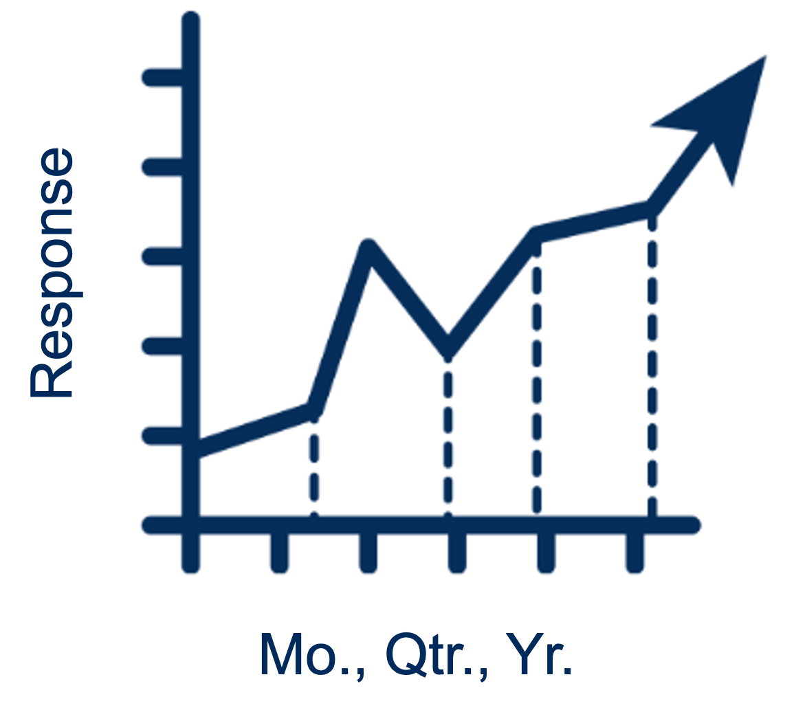{fig-alt="Time series" height="400px" fig-align="center"}

## Motivating example[@gomes2017association] - background

- The province of Ontario, Canada, introduced limits on blood glucose test strips (BGTS) based on diabetes therapy in 2013
- Concern over the impact of this policy on:
  - Test strip utilization and spending
  - Clinical outcomes

## Motivating example - 2013 policy

| Diabetes group                                | Test strip limits        |
|-----------------------------------------------|--------------------------|
| Insulin users                                 | Max 3,000/year           |
| Hypoglycemia-inducing oral antihyperglycemics | Max 400/year (~30/month) |
| All others                                    | Max 200/year (~16/month) |

## Motivating example - BGTS utilization & costs

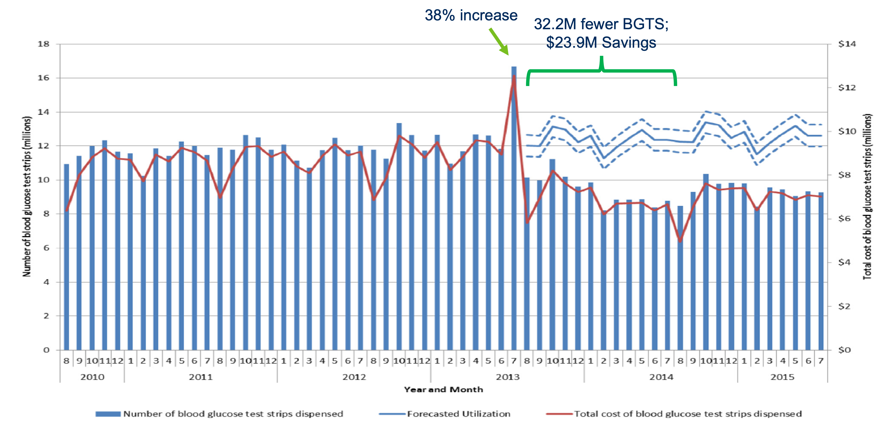{fig-alt="Utilization and costs" height="400px" fig-align="center"}

## Motivating example - clinical outcomes

::: {.columns}
::: {.column width="48%"}
::: {.fragment}
### Design

- Repeated cross-sectional analysis
- April 1, 2008 - March 31, 2015 (quarterly)
- Using interventional ARIMA models
- Stratified by age: <65 vs. 65+ years
:::
:::

::: {.column width="48%"}
::: {.fragment}
### Definitions

Users were hierarchically defined based on their diabetes drug therapy in the prior year to the end of the quarter:

1. Insulin
2. Hypoglycemia-inducing oral antihyperglycemic
3. Other oral antihyperglycemic
4. No drug therapy
:::
:::
:::

## Motivating example - emergency department visits

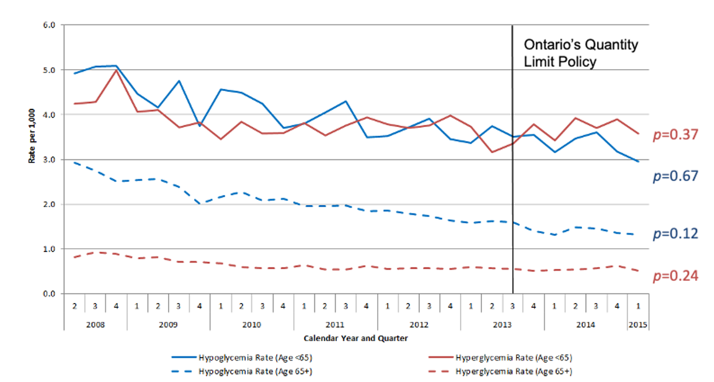{fig-alt="ED visits for hypoglycemia and hyperglycemia" height="400px" fig-align="center"}

## Motivating example - mean HbA1c

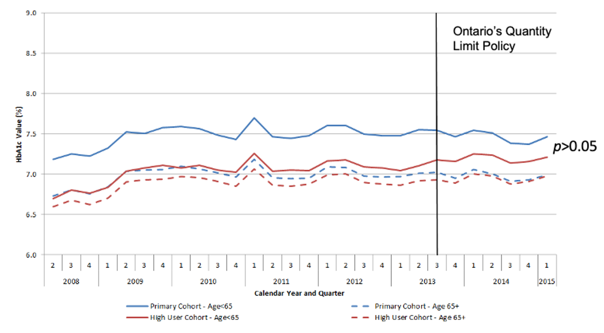{fig-alt="Mean HbA1c" height="400px" fig-align="center"}

## Time series characteristics

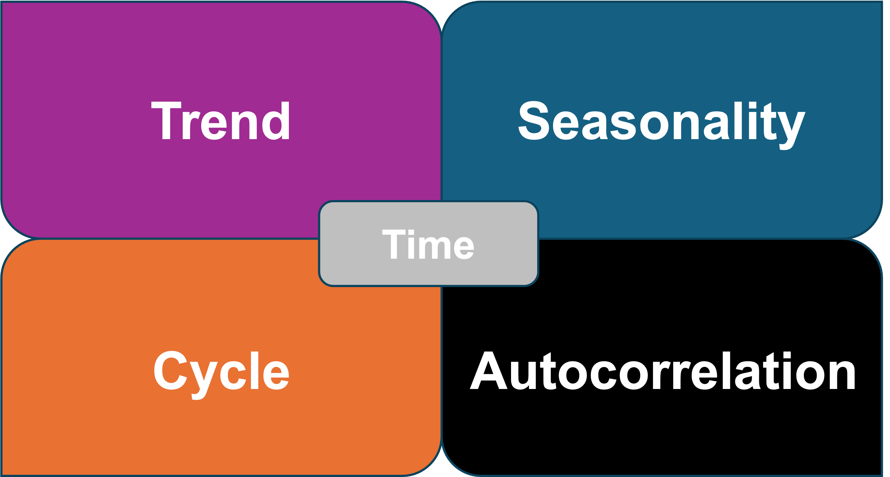{fig-alt="Time series characteristics" height="500px" fig-align="center"}

## Trend

- A persistent, overall upward or downward pattern
- May be due to population growth, shifting prescribing patterns, etc.

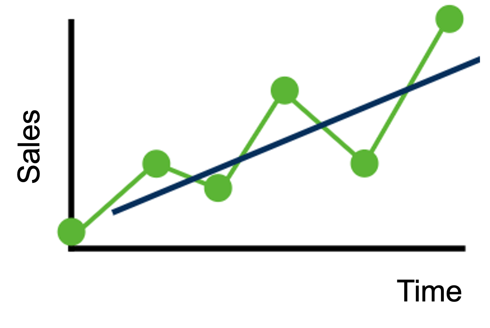{fig-alt="Trend" height="400px" fig-align="center"}

## Seasonality

- Regular up and down fluctuations
- May be due to weather, prescription refills, etc.
- Occurs within one year (unlikely to have seasonality if you have annual data)

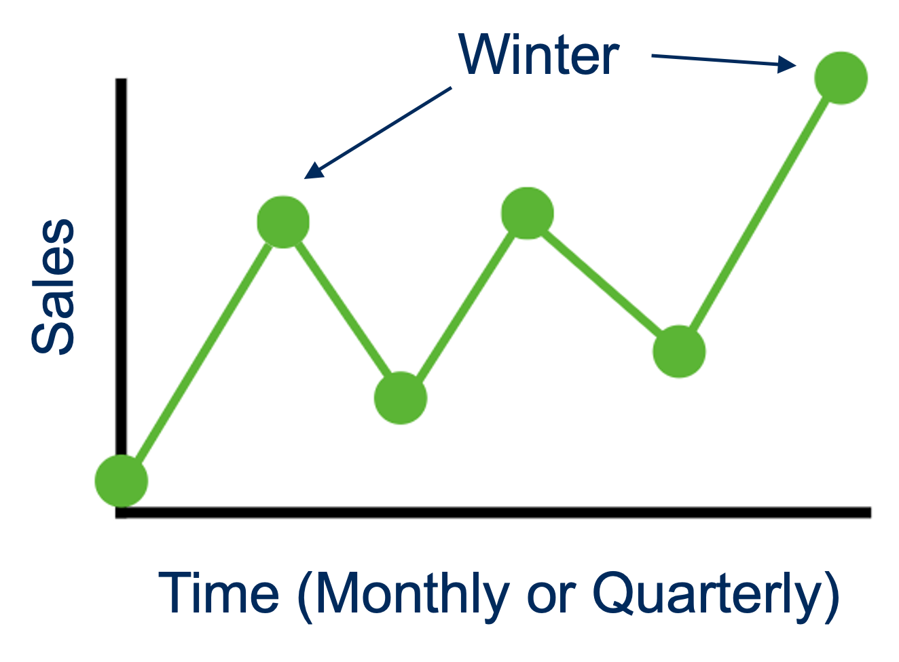{fig-alt="Seasonality" height="400px" fig-align="center"}

## Cycles

- Upward and downward swings
- E.g., housing sales, immigration patterns
- Unlike seasonality, may vary in length, often lasting years on end

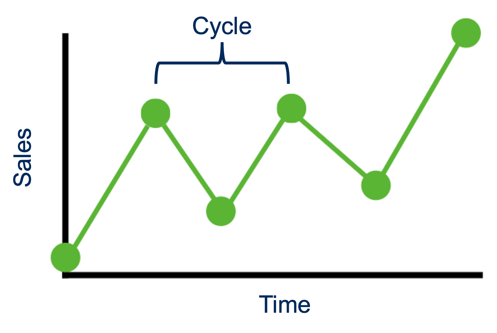{fig-alt="Cycle" height="400px" fig-align="center"}

## Autocorrelation

- The correlation between a data point and a lagged version of itself
- Can be positive or negative
- E.g., stock market, "hot/cold streaks" in sports

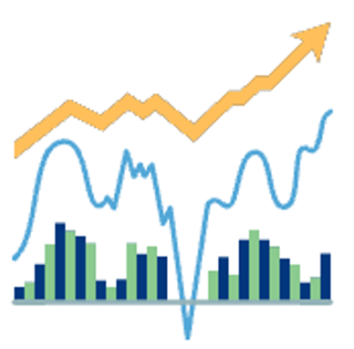{fig-alt="Autocorrelation" height="300px" fig-align="center"}

## Other

::: {.columns}
::: {.column width="48%"}
### Interventions

- Policy/formulary change
- Supply chain disruption
- Pandemic
:::

::: {.column width="48%"}
### Irregularities/randomness

- Not systematic
- Residual fluctuations
- Unrepeating
:::
:::

## Time series analyses

### What kinds of questions do we ask?

::: {.columns}
::: {.column width="48%"}
- Assess impact of interventions
- Forecasting
:::

::: {.column width="48%"}
- Descriptive analysis
- Trend analysis
:::
:::

## Time series analyses

### Approaches

- Regression models that regress $x_t$ on $t$
- ARIMA models that relate the present value to a series of past values and shocks

::: {.fragment}
In ARIMA, the idea is to iteratively model the time series process - you'll know when you're successful because the residuals will be patternless **white noise**:

- Mean 0
- Variance constant
- Uncorrelated
:::

## Regression

$$
x_t = f(t)
$$

::: {.fragment}
- **Trend:** e.g., linear $t$, quadratic $t^2$
- **Seasonality:** an indicator variable for each season
:::

::: {.fragment}
For example, a time series with **linear trend** and **quarterly seasonality** may be modelled with:
$$
x_t = \beta_1 t + \alpha_1 S_1 + \alpha_2 S_2 + \alpha_3 S_3 + \alpha_4 S_4 + \epsilon_t
$$
:::

## ARIMA

- **AR:** autoregression
- **I:** integrated
- **MA:** moving average

## Autoregression (AR model)

AR(1) means that we use the last 1 observation to predict the present time:
$$
\begin{align}
x_t
&= \delta + \phi x_{t-1} + w_t \\
&= \delta + \phi (\delta + \phi x_{t-2} + w_{t-1}) + w_t \\
&...
\end{align}
$$

- $\delta$ is the intercept
- $\phi$ is the slope (persistence); $|\phi| < 1$ for stationary series, meaning the influence of previous lags decays over time
- $w_t \overset{iid}{\sim} N(0,\sigma_w^2)$

## Autoregression (AR model)

| $t$ | $x_t$ | $x_{t-1}$ |
|-----|-------|-----------|
| 1   | 8     | *         |
| 2   | 10    | 8         |
| 3   | 11    | 10        |
| 4   | 7     | 11        |
| 5   | 9     | 7         |

- The present value carries information from everything before, because the relationship is transmitted through intermediate lags

## Autoregression (AR model)

- AR(1)

$$
x_t = \delta + \phi_1 x_{t-1} + w_t
$$

- AR(2)

$$
x_t = \delta + \phi_1 x_{t-1} + \phi_2 x_{t-2} + w_t
$$

## Autocorrelation function (ACF)

- Correlations between $x_t$ and lagged values ($t-1, t-2, t-3, \dots$)
- Useful for applying to both the raw series, as well as the model residuals

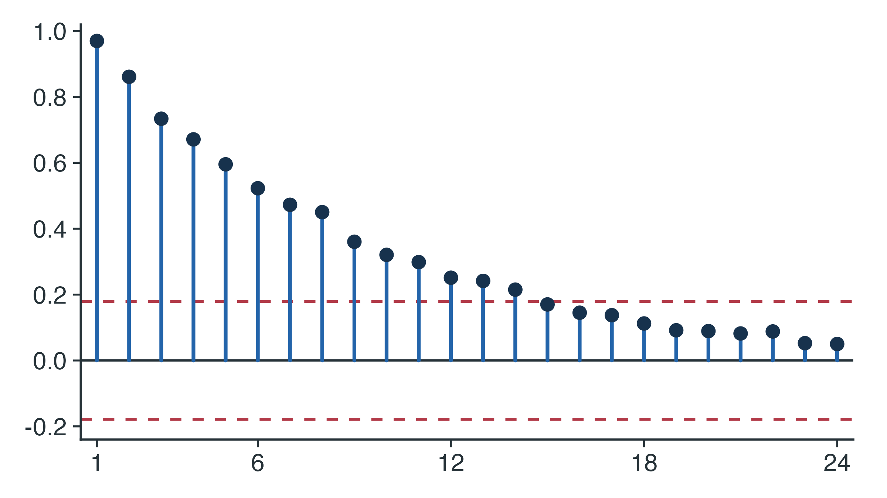{fig-alt="ACF" height="300px" fig-align="center"}

## Partial autocorrelation function (PACF)

- Correlation between $x_t$ and $x_{t-h}$ after conditioning on the values in between
- Does $x_{t-h}$ have a direct effect on $x_t$ that is not via intermediate values?

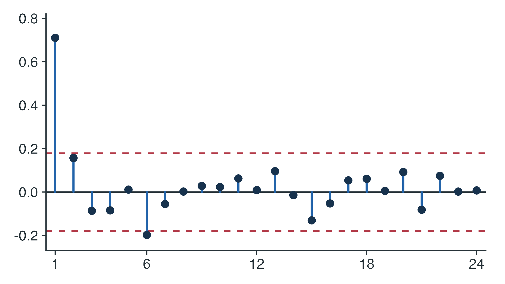{fig-alt="PACF" height="225px" fig-align="center"}

- Very useful for determining AR orders
- PACF will spike at the corresponding lag, then shut off to zero afterwards

## Stationarity

- A series is (weakly) stationary if:
  - Mean constant
  - Variance constant
  - Covariance between $x_t$ and $x_{t-h}$ is the same for all $t$ at each lag $h$
- White noise is a special type of stationarity
- Stationarity may be addressed with **differencing**

::: {.key-point}
ACF and PACF patterns (later) will not have their standard interpretations until the series is stationary. ACF of a non-stationary series will decay very slowly.
:::

## Stationarity

::: {.columns}
::: {.column width="48%"}
### Trend violates stationarity

Augmented Dickey-Fuller (ADF) test:

$p>0.05$ suggests a need to **difference**.
:::

::: {.column width="48%"}
### Seasonality violates stationarity

Osborn-Chui-Smith-Birchenhall (OCSB) test:

$p>0.05$ suggests a need to **seasonally difference**.
:::
:::

## Differencing

- Think of it as differentiation but for a discrete variable
- First differencing:

$$
\nabla x_t = x_t – x_{t-1}
$$

- Second differencing:

$$
\nabla^2 x_t = \nabla x_t - \nabla x_{t-1}
$$

- We often need first differencing, and rarely more than second differencing
- Over-differencing can introduce autocorrelation where none existed before

## Seasonal differencing

- Seasonal (here, monthly) differencing:

$$
\nabla^{12} x_t = x_t – x_{t-12}
$$

- Seasonality skips intermediate lags
- Not the same as twelfth differencing

## Moving average (MA model)

- AR processes are not the only way to generate autocorrelation
- While AR captures autocorrelation in past *values* (e.g., $x_{t-1}$), MA captures autocorrelation in past *shocks* (e.g., $w_{t-1}$)
- Shocks are prediction errors

::: {.key-point}
- In AR models, the present value carries information from everything before
- In MA models, the present value carries information from a set number of lags
:::

## Moving average (MA model)

- MA(1)

$$
x_t = \mu + \theta_1 w_{t-1} + w_t
$$

- MA(2)

$$
x_t = \mu + \theta_1 w_{t-1} + \theta_2 w_{t-2} + w_t
$$

## ARIMA

- Can include AR terms, differencing operations, and MA terms
- Technically, "IARMA" in the sense that you should difference (if needed) first, to ensure stationarity, before figuring out AR and MA terms
- Without seasonality: $ARIMA \; (p,d,q)$
- With seasonality: $ARIMA \; (p,d,q) \times (P,D,Q)_S$

## Correlogram patterns

| True model | ACF    | PACF              |
|------------|--------|-------------------|
| AR         | Tapers | Cuts off past $p$ |
| MA         | Cuts off past $q$ | Tapers |
| ARMA       | Tapers | Tapers            |

- May not see clean patterns in sample data
- Sign (+/-) of autocorrelation does not matter for identifying orders
- If all lags are non-significant, suggests that series is white noise

## Identify the model:[@pennstateeberlycollegeofscience2026stat] #1

| True model | ACF    | PACF              |
|------------|--------|-------------------|
| AR         | Tapers | Cuts off past $p$ |
| MA         | Cuts off past $q$ | Tapers |

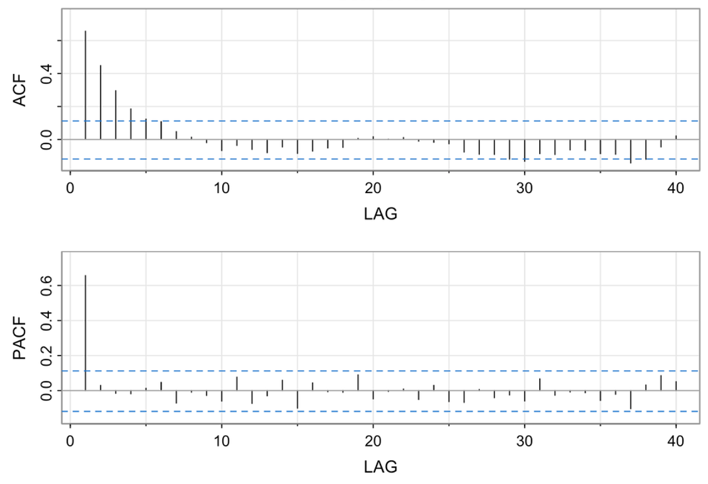{fig-alt="AR(1)" height="400px" fig-align="center"}

## Identify the model:[@pennstateeberlycollegeofscience2026stat] #2

| True model | ACF    | PACF              |
|------------|--------|-------------------|
| AR         | Tapers | Cuts off past $p$ |
| MA         | Cuts off past $q$ | Tapers |

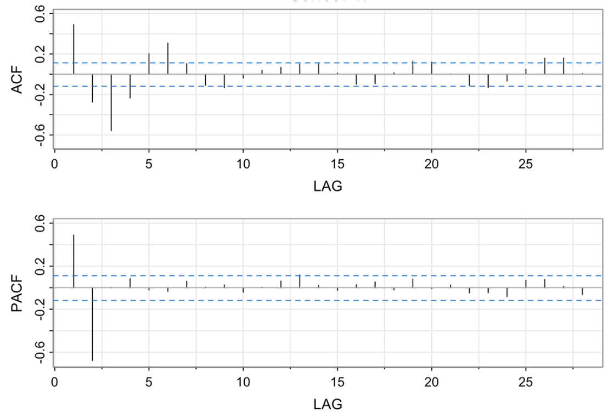{fig-alt="AR(2)" height="400px" fig-align="center"}

## Identify the model:[@pennstateeberlycollegeofscience2026stat] #3

| True model | ACF    | PACF              |
|------------|--------|-------------------|
| AR         | Tapers | Cuts off past $p$ |
| MA         | Cuts off past $q$ | Tapers |

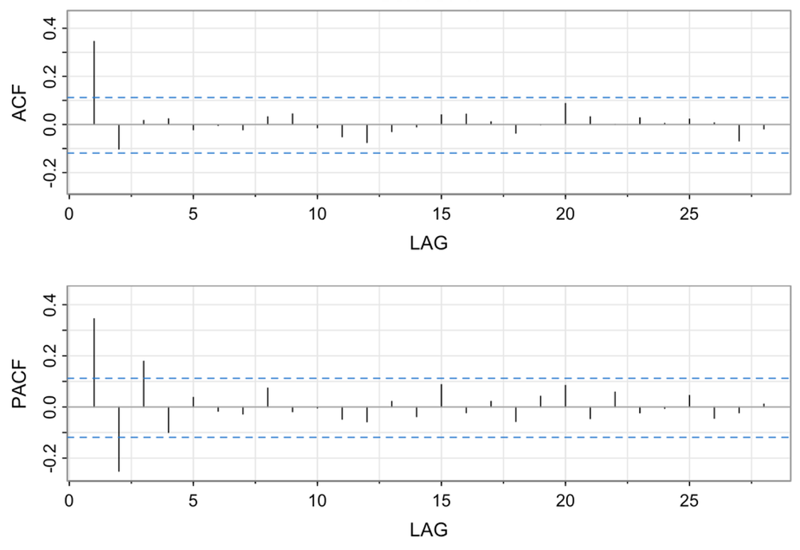{fig-alt="MA(1)" height="400px" fig-align="center"}

## Identify the model:[@pennstateeberlycollegeofscience2026stat] #4

| True model | ACF    | PACF              |
|------------|--------|-------------------|
| AR         | Tapers | Cuts off past $p$ |
| MA         | Cuts off past $q$ | Tapers |

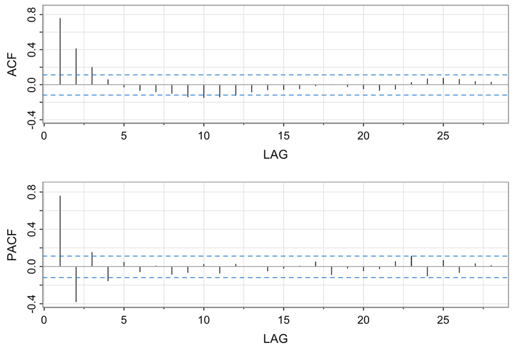{fig-alt="ARMA(1,1)" height="400px" fig-align="center"}

## Diagnostics

| Check: | What do we want to see? |
|--------|-------------------------|
| Coefficients | Significant |
| ACF plot of the residuals | Not significant |
| Ljung-Box test for white noise of the residuals | Not significant |
| Q-Q plot of the residuals | Normality |
| Histogram of the residuals | Normality |
| Residuals-versus-fits plot | No heteroskedasticity |
| Time series plot of the residuals | No heteroskedasticity |
| Forecasts | Reasonable (e.g., not decreasing when expect to increase) |

- Try a different ARIMA model if unsatisfactory

## Comparing models

- Parsimony (low orders)
- Smallest standard errors of forecast values
- Best model fit, while not being overly complex - smaller values of:
  - Akaike information criterion (AIC)
  - AIC with correction for small sample size (AICc)
  - Bayesian information criterion (BIC)

## ARIMA steps

1. Plot the time series
  - Pay attention to seasonality and trends, informed also by OCSB and ADF tests
  - If both seem possible, do seasonal differencing first as seasonality tends to dominate, then re-evaluate
  - If heteroskedasticity, consider log transform

## ARIMA steps

2. Plot correlograms
  - Examine the ACF and PACF
  - Glean AR and MA terms at low lags, and seasonal AR and MA terms at lags at multiples of $S$
3. Estimate the model
4. Perform diagnostics and select the best model
  - Iterate if necessary

## Intervention analysis

- Goes beyond modelling the time series; also estimate the effect of an intervention (e.g., policy, formulary change, supply chain disruption, pandemic)
- Ecological; in Ontario, Canada, we use administrative claims data stored at ICES

::: {.fragment}
- **Quasi-experimental studies (QES)** (intervention is as good as random, because assignment is plausibly unrelated to the outcome)
- **Interrupted time series (ITS) analysis** is one type of QES; counterfactual is what the time series would have been had the intervention not occurred
  - Segmented regression
  - Interventional ARIMA
:::

## Intervention analysis: segmented regression
$$
y_t = \beta_0 + \beta_1 t + \beta_2 I_t + \beta_3 (t \times I_t) + \epsilon_t
$$

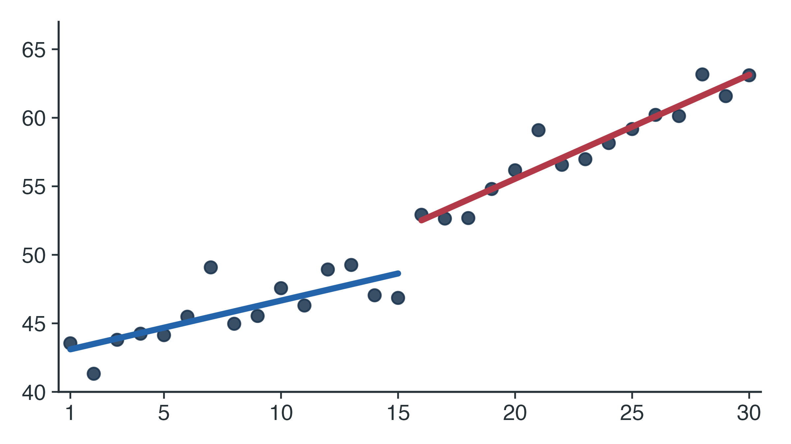{fig-alt="Segmented regression" height="400px" fig-align="center"}

## Intervention analysis: segmented regression

Let's break this down into two regression lines (set $t = 0$ for time of intervention):
$$
\begin{align}
\text{Before intervention } (I_t = 0) &: y_t = \beta_0 + \beta_1 t + \epsilon_t \\
\text{After intervention } (I_t = 1) &: y_t = (\beta_0 + \beta_2) + (\beta_1 + \beta_3) t
\end{align}
$$

- $\beta_0$ is the pre-intervention level (extrapolated) at the time of intervention
- $\beta_1$ is the pre-intervention slope (trend)
- $\beta_2$ is the immediate change in level at the intervention
- $\beta_3$ is the change in slope (trend) following the intervention
- $\beta_1 + \beta_3$ is the post-intervention slope

## Intervention analysis: segmented regression

- Can model non-linear deterministic trend with polynomials or splines
- Can model deterministic seasonality using indicator variables

## Intervention analysis: interventional ARIMA

$$
y_t = \delta_0 I_t + w_t
$$

- $I_t$ is the intervention (see next slide)
- $w_t \sim ARIMA \; (p,d,q) \times (P,D,Q)$

## Intervention analysis: interventional ARIMA[@schaffer2021interrupted]

::: {.columns}
::: {.column width="68%"}
| Intervention            | Equation                                                                               |
|-------------------------|----------------------------------------------------------------------------------------|
| Permanent step          | $I_t = \begin{cases} 0, & t < T \\ 1, & t \geq T \end{cases}$                          |
| Temporary step over $d$ | $I_t = \begin{cases} 0, & t < T \\ 1, & T \leq t < T+d \\ 0, & t \geq T+d \end{cases}$ |
| Pulse                   | $I_t = \begin{cases} 0, & t \neq T \\ 1, & t = T \end{cases}$                          |
| Ramp                    | $I_t = \begin{cases} 0, & t < T \\ t-T+1, & t \geq T \end{cases}$                      |
:::

::: {.column width="28%"}
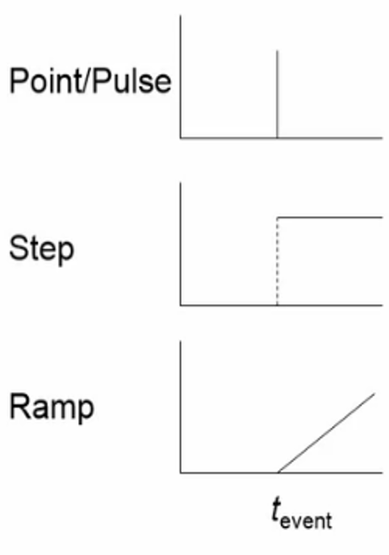{fig-alt="Interventions" height="400px" fig-align="center"}
:::
:::

- You can model multiple interventions (e.g., step + ramp)
- Interventions should be pre-specified

## Name that fit: #1

::: {.columns}
::: {.column width="38%"}
**Scenario:** Drug recall and shortage in July 2018
:::

::: {.column width="58%"}
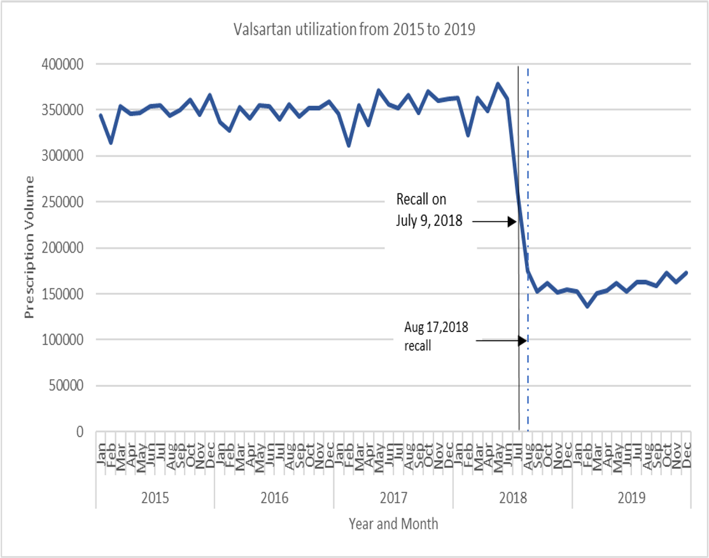{fig-alt="Intervention example 1" height="500px" fig-align="center"}
:::
:::

## Name that fit: #2

::: {.columns}
::: {.column width="38%"}
**Scenario:** COVID-19 pandemic lockdowns impact on salbutamol (albuterol) inhalers
:::

::: {.column width="58%"}
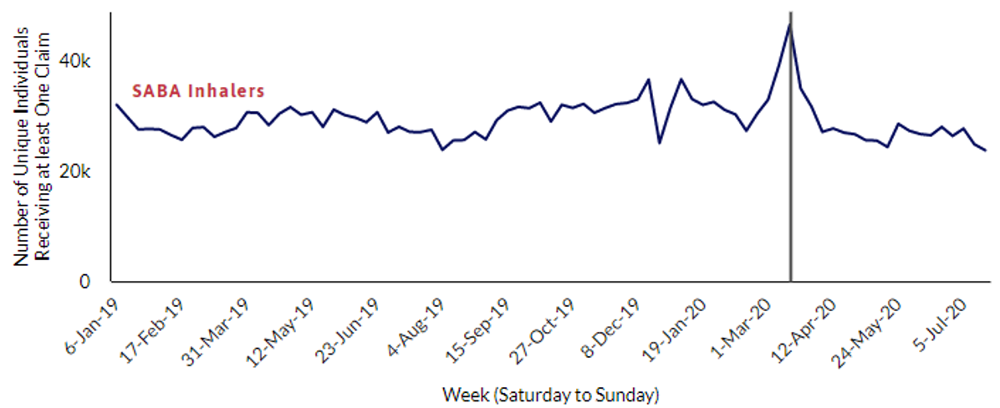{fig-alt="Intervention example 2" height="500px" fig-align="center"}
:::
:::

## Name that fit: #3

::: {.columns}
::: {.column width="38%"}
**Scenario:** Introduction of a new biosimilar on formulary
:::

::: {.column width="58%"}
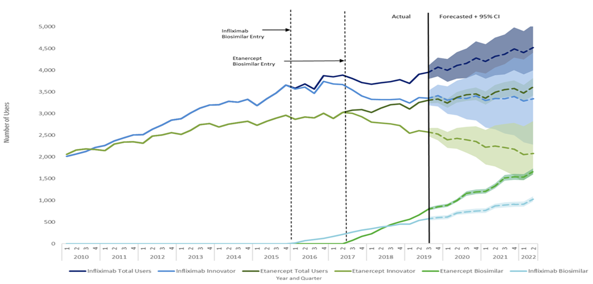{fig-alt="Intervention example 3" height="500px" fig-align="center"}
:::
:::

## Name that fit: #4

::: {.columns}
::: {.column width="38%"}
**Scenario:** New policy to limit access to a medication class, announced with one month until change
:::

::: {.column width="58%"}
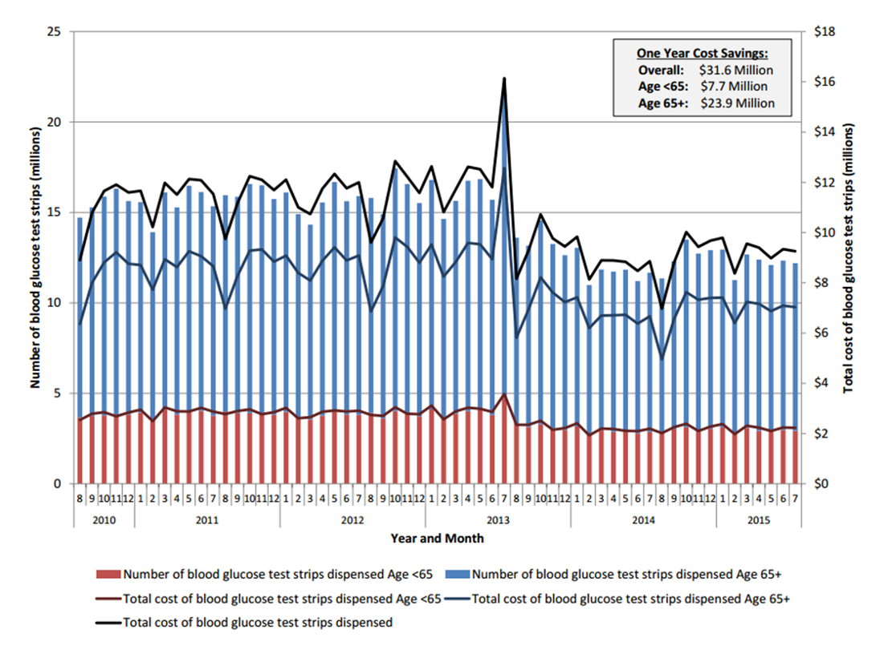{fig-alt="Intervention example 4" height="500px" fig-align="center"}
:::
:::

## References {#refs}

